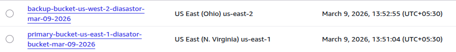
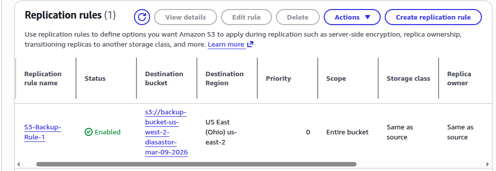
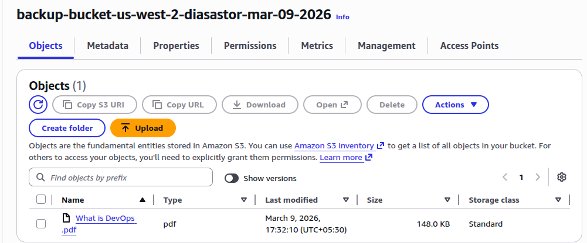

# Disaster Recovery & Backup

## Project 1: Multi-Region Disaster Recovery Plan – Cross-Region Replication for S3 & RDS

### Introduction
A multi-region disaster recovery (DR) plan ensures business continuity by replicating critical data and applications across AWS regions. In this project, we will set up **Cross-Region Replication (CRR)** for S3 and **Read Replica** for RDS to maintain availability in case of regional failures.

---

## Steps to Implement the Multi-Region Disaster Recovery Plan

### 1. Set Up S3 Cross-Region Replication (CRR)

**Step 1: Create Two S3 Buckets**
- Navigate to AWS S3 Console → Create two buckets in different AWS regions (e.g., `primary-bucket-us-east-1` and `backup-bucket-us-west-2`).
- Enable **Versioning** on both buckets.



**Step 2: Configure IAM Role & Permissions**
- Create an IAM Role with `s3:ReplicateObject` permission.
- Attach this role to your primary S3 bucket.
```bash

{
    "Version": "2012-10-17",
    "Statement": [
        {
            "Sid": "SourceBucketPermissions",
            "Effect": "Allow",
            "Action": [
                "s3:GetObjectRetention",
                "s3:GetObjectVersionTagging",
                "s3:GetObjectVersionAcl",
                "s3:ListBucket",
                "s3:GetObjectVersionForReplication",
                "s3:GetObjectLegalHold",
                "s3:GetReplicationConfiguration"
            ],
            "Resource": [
                "arn:aws:s3:::primary-bucket-us-east-1-diasator-bucket-mar-09-2026",
                "arn:aws:s3:::primary-bucket-us-east-1-diasator-bucket-mar-09-2026/*"
            ]
        },
        {
            "Sid": "DestinationBucketPermissions",
            "Effect": "Allow",
            "Action": [
                "s3:ReplicateObject",
                "s3:ObjectOwnerOverrideToBucketOwner",
                "s3:ReplicateTags",
                "s3:ReplicateDelete"
            ],
            "Resource": [
                "arn:aws:s3:::backup-bucket-us-west-2-diasastor-mar-09-2026/*"
            ]
        }
    ]
}
```
----------

**Step 3: Enable Cross-Region Replication**
- Go to the primary S3 bucket → Select **Replication Rules** → Create a new rule.
- Set Destination Bucket as the backup bucket (`backup-bucket-us-west-2`).
- Choose the IAM Role created earlier.
- Optionally enable **Replica Modification Sync** to replicate ACLs, metadata, and encryption settings.



**Step 4: Validate Replication**
- Upload files to the primary bucket and check if they are replicated to the backup bucket.



---

### 2. Set Up RDS Cross-Region Read Replica

**Step 1: Launch an RDS Instance**
- Create an RDS instance in Region A (e.g., `us-east-1`).
- Choose **Multi-AZ Deployment** for high availability.

**Step 2: Enable Automated Backups**
- Go to **Modify RDS Instance** → Enable Automated Backups.

**Step 3: Create a Cross-Region Read Replica**
- Open AWS RDS Console → Select your primary RDS instance.
- Click on **Actions → Create Read Replica**.
- Select a different AWS region (e.g., `us-west-2`).
- Choose the instance class and storage settings.
- Enable **Replication Monitoring**.

**Step 4: Configure Failover Mechanism**
- In case of failure in Region A, manually promote the read replica to become the primary database.
- Update application connection settings to point to the new primary instance.

---

### 3. Set Up Route 53 for Failover Routing

- Create a **Route 53 DNS Record** with **Failover Routing Policy**.
- Define a primary health check for the main S3 bucket and RDS instance.
- Set up a secondary health check for the backup region.
- Route traffic to the backup region when the primary fails.

---

## Testing & Validation

1. **Test S3 Replication**: Upload a file to the primary bucket and verify replication.
2. **Test RDS Read Replica**: Run queries on the read replica to check for data consistency.
3. **Simulate Failover**: Stop the primary instance and validate automatic traffic redirection to the backup region.

---

## Conclusion
By implementing **S3 Cross-Region Replication (CRR)** and **RDS Read Replica**, we achieve high availability and disaster recovery for critical AWS resources. This setup minimizes downtime and ensures business continuity in case of regional failures.

---

## Project 2: Backup Strategies with AWS Backup & Lifecycle Policies

### Introduction
While disaster recovery focuses on availability during regional failures, **backup strategies** ensure long-term data protection and compliance. In this project, we will use **AWS Backup** and **S3 Lifecycle Policies** to automate backups and retention.

---

## Steps to Implement Backup Strategies

### 1. Configure AWS Backup

**Step 1: Create a Backup Vault**
- Open AWS Backup Console → Create a **Backup Vault**.
- Define encryption settings and access policies.

**Step 2: Create a Backup Plan**
- Define backup rules (frequency, retention period).
- Select resources (RDS, EFS, DynamoDB, EC2 volumes).
- Assign IAM roles for backup operations.

**Step 3: Assign Resources**
- Attach AWS resources to the backup plan.
- Ensure automated backups run according to schedule.

---

### 2. Set Up S3 Lifecycle Policies

**Step 1: Define Storage Classes**
- Use **Standard** for frequently accessed data.
- Transition older data to **Glacier** or **Glacier Deep Archive** for cost savings.

**Step 2: Create Lifecycle Rules**
- Navigate to S3 bucket → **Management → Lifecycle Rules**.
- Define rules to transition objects after a set number of days.
- Configure expiration policies to delete outdated data.

---

### 3. Validate Backup & Restore

- Run test backups and restore operations.
- Verify data integrity after restoration.
- Ensure compliance with retention policies.

---

## Testing & Validation

1. **Test AWS Backup**: Trigger a manual backup and restore operation.
2. **Test Lifecycle Policies**: Upload files and confirm transition to Glacier after the defined period.
3. **Audit Logs**: Review CloudWatch and AWS Backup logs for compliance.

---

## Conclusion
By implementing **AWS Backup** and **S3 Lifecycle Policies**, we ensure reliable data protection, compliance with retention requirements, and cost optimization. Together with the disaster recovery plan, this provides a complete strategy for resilience and business continuity.
